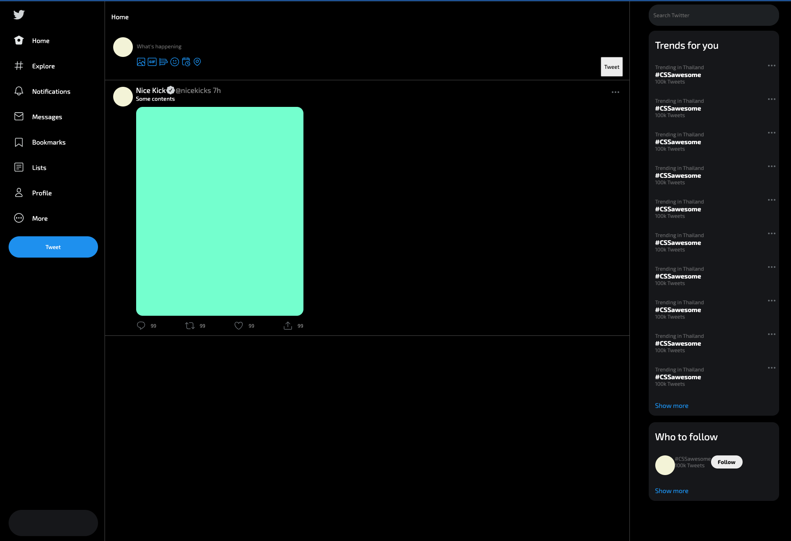

# 🐦 Twitter Clone (HTML + CSS Only)

A simple Twitter clone built entirely using **HTML** and **CSS**. This project replicates the user interface of Twitter, focusing on layout, styling, and responsive design without any JavaScript functionality.

---

## 🔍 Features

- 🖥️ Clean and modern Twitter UI
- 📱 Responsive design (mobile-friendly)
- 📄 Static layout using only HTML and CSS
- 🧩 Custom CSS for navbar, tweets, sidebar, and profile sections

---

## 📁 Project Structure

twitter-clone/
├── index.html
├── style.css
├── icons/
│ └── sidebar/ # Profile pictures, logos, icons
│ └── tweet/ # Profile pictures, logos, icons
│ └── writeTweet/ # Profile pictures, logos, icons

---

## 📸 Screenshots

> Add screenshots here if you'd like  
> Example:
> 

---

## 🚀 Getting Started

1. Clone this repository:

   ```bash
   git clone https://github.com/yourusername/twitter-clone-html-css.git
   ```

2. Open index.html in your browser.

## 📌 Notes

- This is a front-end only clone. There is no backend or functionality like posting, following, or liking.
- No JavaScript is used – the project is purely HTML and CSS.
- Built for practice and educational purposes.
